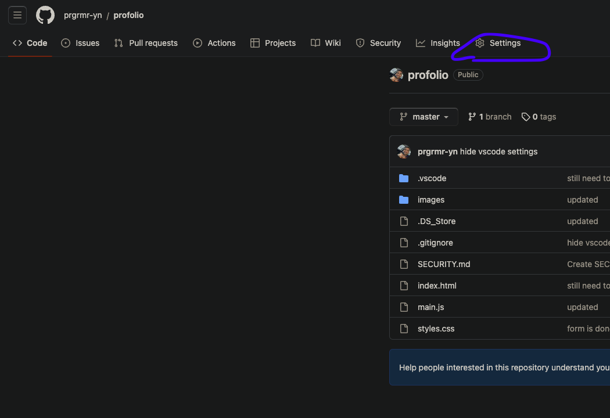
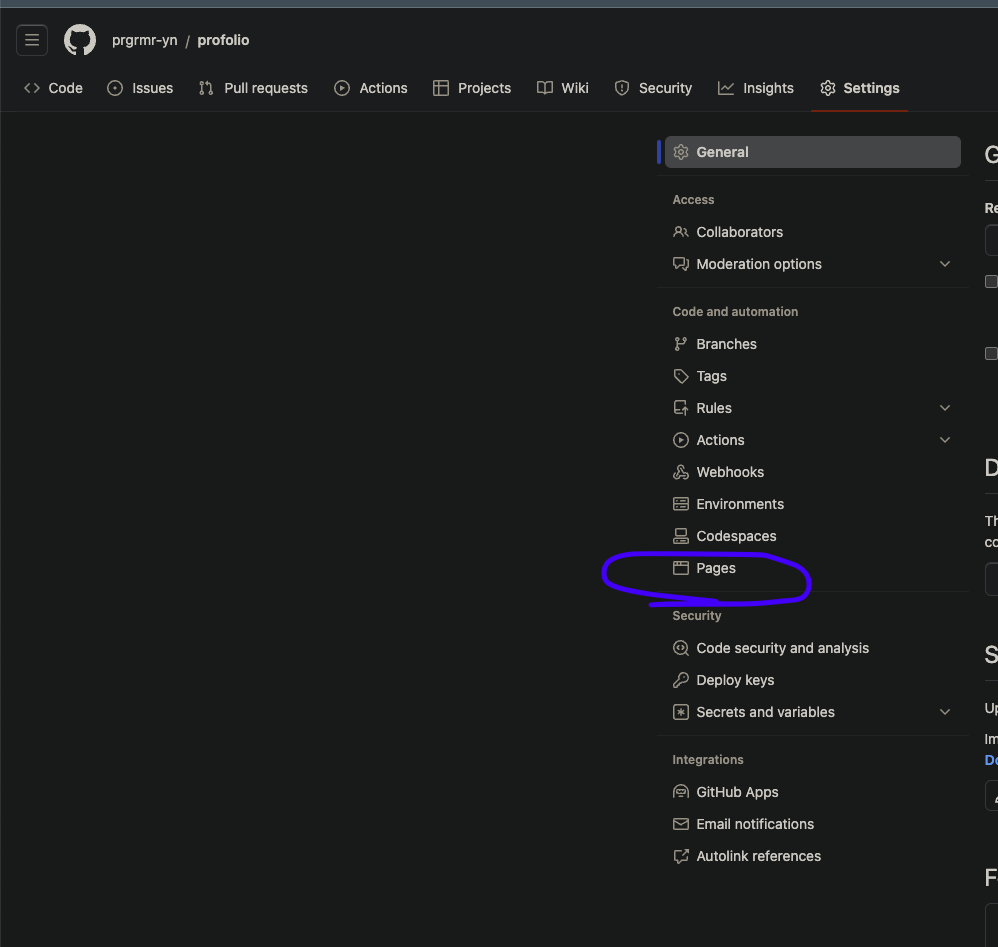
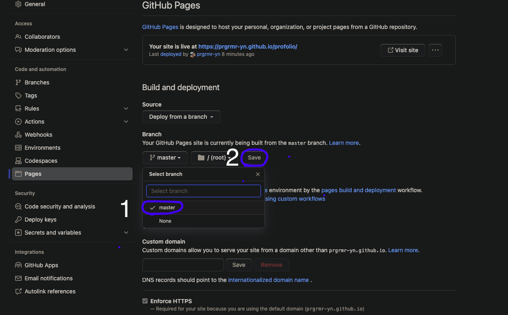

# Profolio

Welcome to my Profolio project! This repository serves as a portfolio showcasing my work, skills, and achievements.

## Getting Started

To get started with this project, follow the steps below:
This project was made using youtube by following the instruction of this [video](https://youtu.be/0YFrGy_mzjY)

### Prerequisites

Github Account,
HTML CSS JS KNOLEDGE

### Clone the Project

1. First, you need to fork this repository to your GITHUB.
2. Get familiar wih the code, The code is all sectioned so its easy to follow.
3. Change the placeholder images and text to your own services and projects.
4. The website has a contact form which can be connected to your google sheets, follow this [youtube](https://youtu.be/0YFrGy_mzjY?t=6474) video change the google id to yours

### Host it Online

1. First go in settings in your repository

2. Click on pages

3. Click on branch and select master(or main) and click save, after few minutetes url will apear on the same page, just keep refreshing it

4. All Done :)

### Star It
If this repo helped you , dont forget to star it :)
